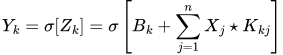

# cnn - convolutional neural network

This is an n-dimensional convolutional neural network, written from
scratch in Julia. It implements the following [layer types][1]:

* [`Conv`][2]: convolutional layer
* [`Pool`][3]: mean pooling, combine neuron clusters
* [`Flatten`][4]: flatten output of `Conv` to vector
* [`Dense`][5]: dense/fully connected layer

> :warning: **Warning**\
> Further optimization and testing with higher-dimensional datasets is
> needed. Until then, the network is rather slow and unexpected errors
> might occur.

## Usage

First, initialize the neural network by chaining different layers and
storing them in a vector.

```julia
include("network.jl")

layers = [Conv(1 => 2, (28, 28), (5, 5)),
          Pool(2, 2),
          Conv(2 => 3, (12, 12), (5, 5)),
          Pool(2, 2),
          Flatten(3, (4, 4)),
          Dense(48 => 24),
          Dense(24 => 10)]
```

Then train the network on a data batch of type `Data` (defined in
[network.jl][6]). The `train!()` function modifies the networks
parameters based on the average gradient across all data points.
Optionally, the learning rate `η` can be passed (default `η=1.0`). The
function returns the average loss of the network.

```julia
train!(layers, batch, η=10.0)
```

In order to achieve stochastic gradient descent, the `train!()` function
can be called from a `for`-loop. The `forward!()` and `loss()` function
can also be called manually. Have a look at the [examples][7].

## Gradient equations

<picture>
  <source media="(prefers-color-scheme: light)" srcset="./images/forward.svg">
  <source media="(prefers-color-scheme: dark)" srcset="./images/forward_inv.svg">
  
</picture>

Based on the above equation, one can infer the partial derivatives of
the biases, kernels and activations with respect to the loss / cost
using the chain rule.

<picture>
  <source media="(prefers-color-scheme: light)" srcset="./images/gradient.svg">
  <source media="(prefers-color-scheme: dark)" srcset="./images/gradient_inv.svg">
  
</picture>

[1]: ./layers/
[2]: ./layers/conv.jl
[3]: ./layers/pool.jl
[4]: ./layers/flatten.jl
[5]: ./layers/dense.jl
[6]: ./network.jl
[7]: ./examples/
